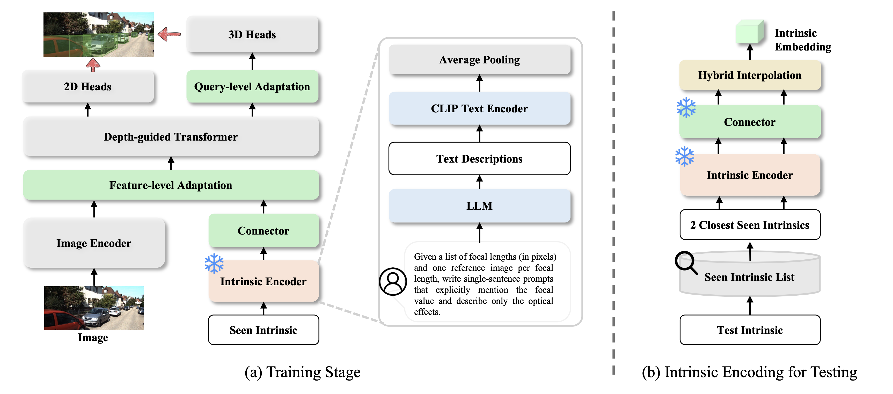
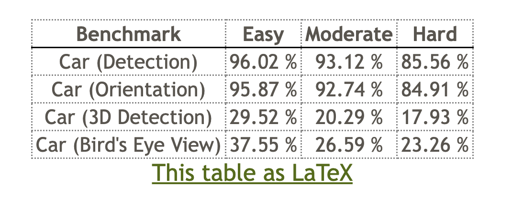

<div align="center">
<h1>Towards Intrinsic-Aware Monocular 3D Object Detection</h1>

<a href="https://arxiv.org/abs/2603.27059"></a>
<a href="https://alanzhangcs.github.io/monoia-page/"></a>
<a href="https://huggingface.co/zhihao406/MonoIA"></a>
<a href="LICENSE"></a>

**[Michigan State University](https://cvlab.cse.msu.edu/); [University of North Carolina at Chapel Hill](https://cvlab.cse.msu.edu/)**

[Zhihao Zhang](https://alanzhangcs.github.io/), [Abhinav Kumar](https://sites.google.com/view/abhinavkumar), [Xiaoming Liu](https://www.cse.msu.edu/~liuxm/index2.html)

[CVPR 2026](https://cvpr.thecvf.com/Conferences/2026/)

</div>

<p align="center">
  
</p>

```bibtex
@inproceedings{zhang2026towards,
    title={Towards Intrinsic-Aware Monocular 3D Object Detection},
    author={Zhang, Zhihao and Kumar, Abhinav and Liu, Xiaoming},
    booktitle={Proceedings of the IEEE/CVF Conference on Computer Vision and Pattern Recognition},
    year={2026}
}
```

## Table of Contents
- [Abstract](#abstract)
- [Updates](#updates)
- [Checklist](#checklist)
- [Method Overview](#method-overview)
- [Installation](#installation)
- [Data Preparation](#data-preparation)
- [Training & Evaluation](#training--evaluation)
- [Model Zoo](#model-zoo)
- [Acknowledgements](#acknowledgements)
- [License](#license)


## Abstract

Monocular 3D object detection (Mono3D) aims to infer object locations and dimensions in 3D space from a single RGB image. Despite recent progress, existing methods remain highly sensitive to camera intrinsics and struggle to generalize across diverse settings, since intrinsic governs how 3D scenes are projected onto the image plane. We propose **MonoIA**, a unified intrinsic-aware framework that models and adapts to intrinsic variation through a language-grounded representation. The key insight is that intrinsic variation is not a numeric difference but a perceptual transformation that alters apparent scale, perspective, and spatial geometry. To capture this effect, MonoIA employs large language models and vision–language models to generate intrinsic embeddings that encode the visual and geometric implications of camera parameters. These embeddings are hierarchically integrated into the detection network via an **Intrinsic Adaptation Module**, allowing the model to modulate its feature representations according to camera-specific configurations and maintain consistent 3D detection across intrinsics. This shifts intrinsic modeling from numeric conditioning to semantic representation, enabling robust and unified perception across cameras. Extensive experiments show that MonoIA achieves new state-of-the-art results on standard benchmarks including KITTI, Waymo, and nuScenes (e.g., **+1.18%** on the KITTI leaderboard), and further improves performance under multi-dataset training (e.g., **+4.46%** on KITTI Val).


## Updates
- [March 28, 2026] Released pretrained models and checkpoints.
- [March 27, 2026] Released official code and training logs.
- [Feb 12, 2026] MonoIA accepted by **CVPR 2026**.

## Checklist
✅ Code release

✅ Pretrained models

✅ Training logs

☐ nuScenes and Waymo datasets config


## Installation

**1. Clone the repository and create the conda environment:**
```bash
git clone git@github.com:alanzhangcs/MonoIA.git
cd MonoIA

conda create -n monoia python=3.9
conda activate monoia
```

**2. Install PyTorch and torchvision (CUDA 12.1):**
```bash
conda install pytorch==2.4.1 torchvision==0.19.1 torchaudio==2.4.1 pytorch-cuda=12.1 -c pytorch -c nvidia
```

**3. Install requirements and compile the deformable attention CUDA ops:**
```bash
pip install -r requirements.txt

cd lib/models/monoia/ops/
bash make.sh
cd ../../../..
```


## Data Preparation

### KITTI

Download the [KITTI 3D Object Detection](https://www.cvlibs.net/datasets/kitti/eval_object.php?obj_benchmark=3d) dataset and organize it under `data/KITTIDataset/` as follows (this should match `dataset.root_dir` in the config):

```
MonoIA/
├── config/
├── data/
│   └── KITTIDataset/
│       ├── ImageSets/
│       ├── training/
│       │   ├── image_2/
│       │   ├── label_2/
│       │   └── calib/
│       └── testing/
│           ├── image_2/
│           └── calib/
```

> **nuScenes and Waymo** dataset configs are coming soon.


## Training & Evaluation

**Train on KITTI:**
```bash
bash train.sh 0 --config config/monoia.yaml
```

**Evaluate on KITTI Val:**
```bash
bash test.sh 0 --config config/monoia_val.yaml
```

**Evaluate for KITTI leaderboard (test set):**
```bash
bash test.sh 0 --config config/monoia_leaderboard.yaml
```

By default, logs and checkpoints are saved under `outputs/` (see `trainer.save_path` in the config). Training runs for 250 epochs with AdamW (lr=2e-4) and step-based LR decay at epochs [85, 125, 165, 205].


## Model Zoo

### KITTI Val

| Setting | Config | AP3D Easy | AP3D Mod. | AP3D Hard | Checkpoint | Training log |
|:---:|:---:|:---:|:---:|:---:|:---:|:---:|
| KITTI | `config/monoia.yaml` | 33.61  | 24.40 | 20.80 | [Model](https://huggingface.co/zhihao406/MonoIA) | [Log](assets/train.log) |

### KITTI Test (Leaderboard)

We provide KITTI test-set submissions on the official [KITTI leaderboard](https://www.cvlibs.net/datasets/kitti/eval_object.php?obj_benchmark=3d):

| Setting | Config | AP3D Easy | AP3D Mod. | AP3D Hard | Checkpoint |
|:---:|:---:|:---:|:---:|:---:|:---:|
| KITTI | `config/monoia_leaderboard.yaml` | 29.52 | 19.11 | 17.93 | [Model](https://huggingface.co/zhihao406/MonoIA) |

<p align="center">
  
</p>


## Acknowledgements

This project builds upon and adapts components from several excellent open-source projects:
- [DEVIANT](https://github.com/abhi1kumar/DEVIANT)
- [MonoDETR](https://github.com/ZrrSkywalker/MonoDETR)
- [MonoDGP](https://github.com/PuFanqi23/MonoDGP)
- [MonoCoP](https://github.com/alanzhangcs/MonoCoP)
- [DETR](https://github.com/facebookresearch/detr)
- [Deformable DETR](https://github.com/fundamentalvision/Deformable-DETR)

We thank the authors for making their code publicly available.

## License
This project is licensed under the MIT License. See [`LICENSE`](LICENSE) in the repository root for details.
